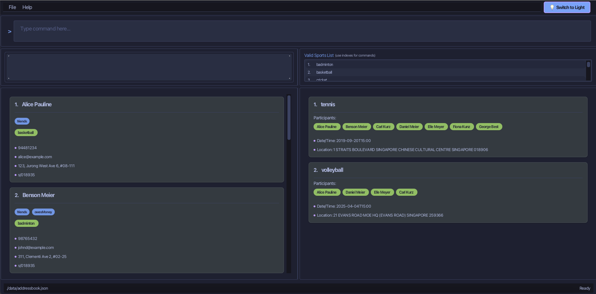

[](https://github.com/se-edu/addressbook-level3/actions)

# FitFriends



## Setting up in Intellij

Prerequisites: JDK 17, update Intellij to the most recent version.

1. Open Intellij (if you are not in the welcome screen, click `File` > `Close Project` to close the existing project first)
2. Open the project into Intellij as follows:
  * Click `Open`. 
  * Select the project directory, and click `OK`. 
  * If there are any further prompts, accept the defaults.
3. Configure the project to use **JDK 17** (not other versions) as explained in [here](https://www.jetbrains.com/help/idea/sdk.html#set-up-jdk).<br>
   In the same dialog, set the **Project language level** field to the `SDK default` option.
4. After that, locate the `PLACEHOLDER_FILE_FOR_NOW` file, right-click it, and choose `Run FitFriends.main()` (if the code editor is showing compile errors, try restarting the IDE). If the setup is correct, you should see something like the below as the output:
      ```
      Hello from
      FITFRIENDS!!!!!!!!!!!!!!!!!!!!!
      ```

**Warning:** Keep the `src\main\java` folder as the root folder for Java files (i.e., don't rename those folders or move Java files to another folder outside of this folder path), as this is the default location some tools (e.g., Gradle) expect to find Java files.

* This is **a sample project for Software Engineering (SE) students**.<br>
  Example usages:
  * as a starting point of a course project (as opposed to writing everything from scratch)
  * as a case study
* The project simulates an ongoing software project for a desktop application (called _AddressBook_) used for managing contact details.
  * It is **written in OOP fashion**. It provides a **reasonably well-written** code base **bigger** (around 6 KLoC) than what students usually write in beginner-level SE modules, without being overwhelmingly big.
  * It comes with a **reasonable level of user and developer documentation**.
* It is named `AddressBook Level 3` (`AB3` for short) because it was initially created as a part of a series of `AddressBook` projects (`Level 1`, `Level 2`, `Level 3` ...).
* For the detailed documentation of this project, see the **[Address Book Product Website](https://se-education.org/addressbook-level3)**.
* This project is a **part of the se-education.org** initiative. If you would like to contribute code to this project, see [se-education.org](https://se-education.org/#contributing-to-se-edu) for more info.
