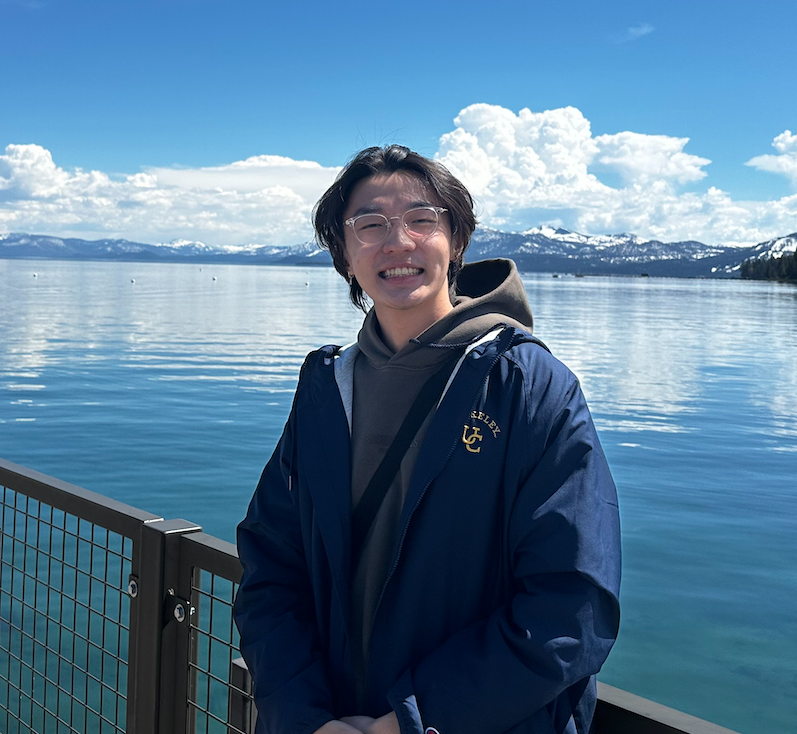
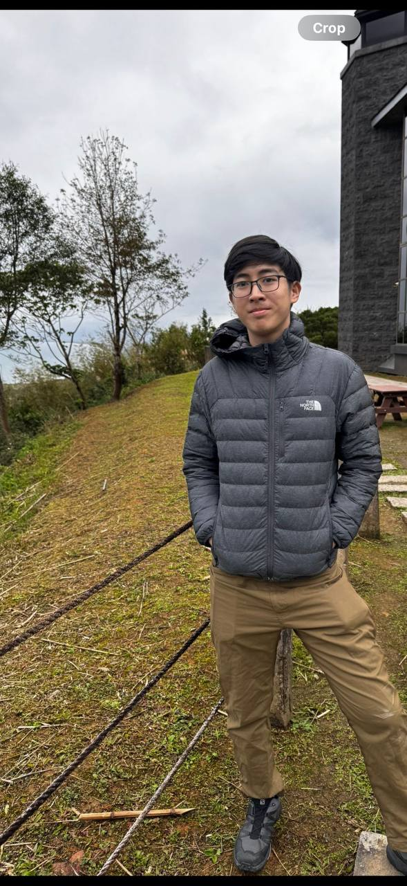
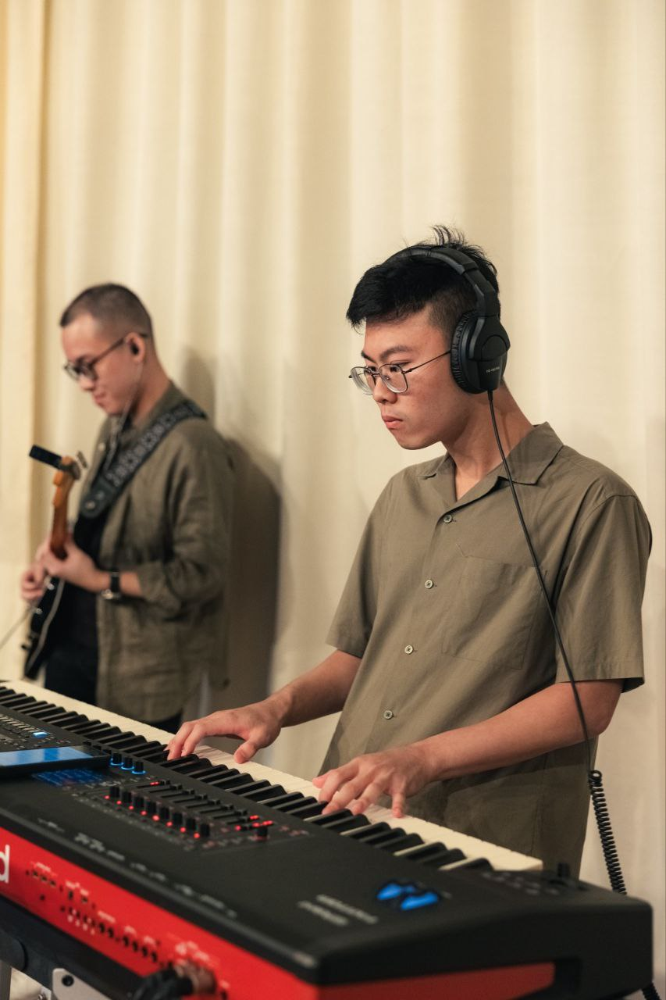

We are a team based in the [School of Computing, National University of Singapore](https://www.comp.nus.edu.sg).

You can reach us at the email `seer[at]comp.nus.edu.sg`

## Project team

### Darren Teo

[[github](https://github.com/darhh)]
[[portfolio](team/darhh.md)]

* Role: Integration, Documentation
* Responsibilities: In charge of versioning of the code, maintaining the code repository, integrating various parts of the software to create a whole. Responsible for the quality of various project documents.

### Goh Lucas

[[github](http://github.com/gohlucas)]
[[portfolio](team/gohLucas.md)]

* Role: Scheduling and Tracking, Documentation
* Responsibilities: In charge of defining, assigning, and tracking project tasks. Responsible for the quality of various project documents.

### Noah Ang

[[github](http://github.com/noahang)]
[[portfolio](team/noahAng.md)]

* Role: Developer
* Responsibilities: Code Quality

### Somneel

[[github](http://github.com/SomneelSaha2004)]
[[portfolio](team/somneel.md)]

* Role: Developer
* Responsibilities: Deliverables and Deadlines

### Isaac Chua

[[github](http://github.com/isaacchua0309)]
[[portfolio](team/isaacchua0309.md)]

* Role: Developer
* Responsibilities: Testing

