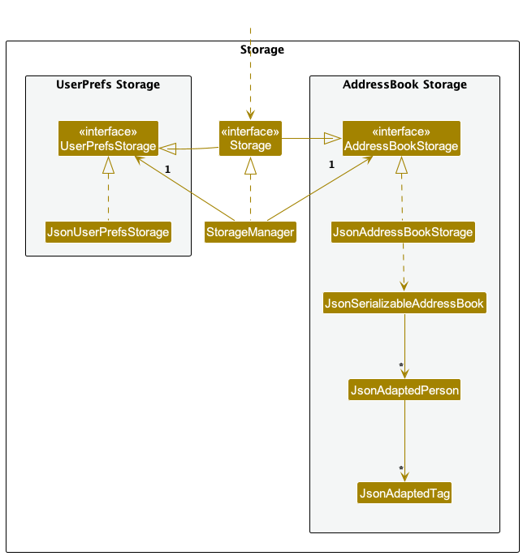

* Table of Contents
{:toc}

--------------------------------------------------------------------------------------------------------------------

## **Acknowledgements**

* {list here sources of all reused/adapted ideas, code, documentation, and third-party libraries -- include links to the original source as well}
* This project is based on the AddressBook-Level3 project created by the [SE-EDU initiative](https://se-education.org).
--------------------------------------------------------------------------------------------------------------------

## **Setting up, getting started**

Refer to the guide [_Setting up and getting started_](SettingUp.md).

--------------------------------------------------------------------------------------------------------------------

## **Design**

:bulb: **Tip:** The `.puml` files used to create diagrams in this document `docs/diagrams` folder. Refer to the [_PlantUML Tutorial_ at se-edu/guides](https://se-education.org/guides/tutorials/plantUml.html) to learn how to create and edit diagrams.

### Architecture

The ***Architecture Diagram*** given above explains the high-level design of the App.

Given below is a quick overview of main components and how they interact with each other.

**Main components of the architecture**

**`Main`** (consisting of classes [`Main`](https://github.com/se-edu/addressbook-level3/tree/master/src/main/java/seedu/address/Main.java) and [`MainApp`](https://github.com/se-edu/addressbook-level3/tree/master/src/main/java/seedu/address/MainApp.java)) is in charge of the app launch and shut down.
* At app launch, it initializes the other components in the correct sequence, and connects them up with each other.
* At shut down, it shuts down the other components and invokes cleanup methods where necessary.

The bulk of the app's work is done by the following four components:

* [**`UI`**](#ui-component): The UI of the App.
* [**`Logic`**](#logic-component): The command executor.
* [**`Model`**](#model-component): Holds the data of the App in memory.
* [**`Storage`**](#storage-component): Reads data from, and writes data to, the hard disk.

[**`Commons`**](#common-classes) represents a collection of classes used by multiple other components.

**How the architecture components interact with each other**

The *Sequence Diagram* below shows how the components interact with each other for the scenario where the user issues the command `delete 1`.

Each of the four main components (also shown in the diagram above),

* defines its *API* in an `interface` with the same name as the Component.
* implements its functionality using a concrete `{Component Name}Manager` class (which follows the corresponding API `interface` mentioned in the previous point.

For example, the `Logic` component defines its API in the `Logic.java` interface and implements its functionality using the `LogicManager.java` class which follows the `Logic` interface. Other components interact with a given component through its interface rather than the concrete class (reason: to prevent outside component's being coupled to the implementation of a component), as illustrated in the (partial) class diagram below.

The sections below give more details of each component.

### UI component

The **API** of this component is specified in [`Ui.java`](https://github.com/se-edu/addressbook-level3/tree/master/src/main/java/seedu/address/ui/Ui.java)

The UI consists of a `MainWindow` that is made up of parts e.g.`CommandBox`, `ResultDisplay`, `PersonListPanel`, `StatusBarFooter` etc. All these, including the `MainWindow`, inherit from the abstract `UiPart` class which captures the commonalities between classes that represent parts of the visible GUI.

The `UI` component uses the JavaFx UI framework. The layout of these UI parts are defined in matching `.fxml` files that are in the `src/main/resources/view` folder. For example, the layout of the [`MainWindow`](https://github.com/se-edu/addressbook-level3/tree/master/src/main/java/seedu/address/ui/MainWindow.java) is specified in [`MainWindow.fxml`](https://github.com/se-edu/addressbook-level3/tree/master/src/main/resources/view/MainWindow.fxml)

The `UI` component,

* executes user commands using the `Logic` component.
* listens for changes to `Model` data so that the UI can be updated with the modified data.
* keeps a reference to the `Logic` component, because the `UI` relies on the `Logic` to execute commands.
* depends on some classes in the `Model` component, as it displays `Person` object residing in the `Model`.

### Logic component

**API** : [`Logic.java`](https://github.com/se-edu/addressbook-level3/tree/master/src/main/java/seedu/address/logic/Logic.java)

Here's a (partial) class diagram of the `Logic` component:

The sequence diagram below illustrates the interactions within the `Logic` component, taking `execute("delete 1")` API call as an example.

:information_source: **Note:** The lifeline for `DeleteCommandParser` should end at the destroy marker (X) but due to a limitation of PlantUML, the lifeline continues till the end of diagram.

How the `Logic` component works:

1. When `Logic` is called upon to execute a command, it is passed to an `AddressBookParser` object which in turn creates a parser that matches the command (e.g., `DeleteCommandParser`) and uses it to parse the command.
1. This results in a `Command` object (more precisely, an object of one of its subclasses e.g., `DeleteCommand`) which is executed by the `LogicManager`.
1. The command can communicate with the `Model` when it is executed (e.g. to delete a person). 
   Note that although this is shown as a single step in the diagram above (for simplicity), in the code it can take several interactions (between the command object and the `Model`) to achieve.
1. The result of the command execution is encapsulated as a `CommandResult` object which is returned back from `Logic`.

Here are the other classes in `Logic` (omitted from the class diagram above) that are used for parsing a user command:

How the parsing works:
* When called upon to parse a user command, the `AddressBookParser` class creates an `XYZCommandParser` (`XYZ` is a placeholder for the specific command name e.g., `AddCommandParser`) which uses the other classes shown above to parse the user command and create a `XYZCommand` object (e.g., `AddCommand`) which the `AddressBookParser` returns back as a `Command` object.
* All `XYZCommandParser` classes (e.g., `AddCommandParser`, `DeleteCommandParser`, ...) inherit from the `Parser` interface so that they can be treated similarly where possible e.g, during testing.

### Model component
**API** : [`Model.java`](https://github.com/se-edu/addressbook-level3/tree/master/src/main/java/seedu/address/model/Model.java)

The `Model` component,

* stores the address book data i.e., all `Person` objects (which are contained in a `UniquePersonList` object).
* stores the currently 'selected' `Person` objects (e.g., results of a search query) as a separate _filtered_ list which is exposed to outsiders as an unmodifiable `ObservableList<Person>` that can be 'observed' e.g. the UI can be bound to this list so that the UI automatically updates when the data in the list change.
* stores a `UserPref` object that represents the user’s preferences. This is exposed to the outside as a `ReadOnlyUserPref` objects.
* does not depend on any of the other three components (as the `Model` represents data entities of the domain, they should make sense on their own without depending on other components)

:information_source: **Note:** An alternative (arguably, a more OOP) model is given below. It has a `Tag` list in the `AddressBook`, which `Person` references. This allows `AddressBook` to only require one `Tag` object per unique tag, instead of each `Person` needing their own `Tag` objects. 

### Storage component

**API** : [`Storage.java`](https://github.com/se-edu/addressbook-level3/tree/master/src/main/java/seedu/address/storage/Storage.java)

The `Storage` component,
* can save both address book data and user preference data in JSON format, and read them back into corresponding objects.
* inherits from both `AddressBookStorage` and `UserPrefStorage`, which means it can be treated as either one (if only the functionality of only one is needed).
* depends on some classes in the `Model` component (because the `Storage` component's job is to save/retrieve objects that belong to the `Model`)

### Common classes

Classes used by multiple components are in the `seedu.address.commons` package.

--------------------------------------------------------------------------------------------------------------------

## **Implementation**

This section describes some noteworthy details on how certain features are implemented.

### `addgame` feature
The `addgame` command creates and adds a new `Game` object into the addressbook. Each `Game` object has 4 attributes: `Sport`, `LocalDateTime`, `Location` and `UniquePersonList` which are specified using the prefixes g/, dt/, pc respectively with their corresponding values. As a `Game` object is initialised without any participants at first, the `UniquePersonList` field is not mutable during initialisation and thus not included in the command.

#### Implementation
The `Game` object is added into a `UniqueGameList` object whenever `addgame` command is called. This mirrors the `Person` object and `UniquePersonList` object interaction very closely. These are shown on the User Interface via fxml code. Subsequently, the writing to and reading from the addressbook.json which stores the data is facilitated using JsonAdaptedGame and JsonAdaptedPerson which helps to convert the information to and from json readable format.

### `deletegame` feature
Similar to `addgame` feature

### \[Proposed\] Data archiving

_{Explain here how the data archiving feature will be implemented}_

--------------------------------------------------------------------------------------------------------------------

## **Documentation, logging, testing, configuration, dev-ops**

* [Documentation guide](Documentation.md)
* [Testing guide](Testing.md)
* [Logging guide](Logging.md)
* [Configuration guide](Configuration.md)
* [DevOps guide](DevOps.md)

--------------------------------------------------------------------------------------------------------------------

## **Appendix: Requirements**

### Product scope

**Target user profile**:

* has a need to manage a significant number of contacts
* has a need for frequent sporting activities with friends
* prefer desktop apps over other types
* can type fast
* prefers typing to mouse interactions
* is reasonably comfortable using CLI apps

**Value proposition**: manage contacts faster than a typical mouse/GUI driven app
so as to reduce the hassle when organizing sports meetups.

### User stories

Priorities: High (must have) - `* * *`, Medium (nice to have) - `* *`, Low (unlikely to have) - `*`

| Priority | As a …​                                     | I want to …​                                                                                            | So that I can…​                                                               |
|----------|---------------------------------------------|---------------------------------------------------------------------------------------------------------|-------------------------------------------------------------------------------|
| `* * *`  | new user                                    | see usage instructions                                                                                  | refer to instructions when I forget how to use the App                        |
| `* * *`  | user                                        | add a new person                                                                                        | so that I can store their information                                         |
| `* * *`  | user                                        | delete a person                                                                                         | remove entries that I no longer need                                          |
| `* * *`  | user                                        | find a person by name                                                                                   | locate details of persons without having to go through the entire list        |
| `* * *`  | sporty person                               | add a person's preferred sport                                                                          | know who to arrange games with when I want to play a certain sport            |
| `* * *`  | sporty person                               | add a friend's contact number                                                                           | contact them to meet up for games in future                                   |
| `* * *`  | user looking to pick up a new sport         | find friends by sport played                                                                            | invite them to play or teach me the sport                                     |
| `* * *`  | network enthusiast                          | see where my contacts live                                                                              | meet up with them more easily                                                 |
| `* * *`  | impromptu person                            | see where my friends live                                                                               | see which friends are in the area when I am out and suddenly want to catch up |
| `* * *`  | caring friend                               | see what sports my friends play                                                                         | arrange a session when I have something to talk about/check on them           |
| `* *`    | sporty person                               | find sports facilities near me                                                                          | play sports there                                                             |
| `* *`    | user                                        | hide private contact details                                                                            | protect the contact details of persons in my address book                     |
| `* *`    | student                                     | receive suggested sports venues based on my group's location                                            | arrange a meetup location which is fair and convenient                        |
| `* *`    | user who prefers structured planning        | book facilities directly through the app                                                                | reduce the hassle of navigating multiple booking applications                 |
| `* *`    | busy professional                           | quickly check for the nearest sports facility before heading down                                       | save time                                                                     |
| `* *`    | user who dislikes long commutes             | set a maximum travel distance to be used to filter out addresses that are too far away from my location | receive suggestions from the application which fall within my preferred range |
| `* *`    | user                                        | be able to edit an existing contact                                                                     | update their contact details                                                  |
| `* *`    | working professional                        | add my favourite sports venues                                                                          | quickly suggest them for meetups                                              |
| `* *`    | thrifty user                                | be able to filter results only to show free to use facilities                                           | enjoy sports without paying for private courts                                |
| `* *`    | tennis player                               | be reminded to bring my racket                                                                          | save the trouble of having to borrow a racket at the last minute              |
| `* *`    | sporty person                               | set my friend's preferred play locations                                                                | know where to meet them for games                                             |
| `* *`    | working adult                               | tag contacts with custom labels                                                                         | categorize them by friends/work                                               |
| `* *`    | sports coach                                | track where my students live                                                                            | organize training sessions at convenient locations                            |
| `* *`    | user with many persons in the address book  | sort persons by name                                                                                    | locate a person easily                                                        |
| `*`      | sports team captain from NUS                | find friends from the same sport in different schools                                                   | arrange friendly tournaments                                                  |
| `*`      | team captain                                | be able to add my contacts to a list of players who attended a practice session                         | keep track of attendance easily                                               |
| `*`      | sports enthusiast                           | add my friends to my sports address book                                                                | quickly check who plays the sport I want to participate in                    |
| `*`      | casual futsal player                        | invite my friends and have the application suggest a location                                           | save the effort of checking different venues manually                         |
| `*`      | newcomer to the city                        | find people nearby who play my favourite sport                                                          | join their games                                                              |
| `*`      | competitive athlete                         | see a leaderboard of who has played the most games                                                      | gain motivation and stay active                                               |
| `*`      | social athlete                              | be reminded who plays with me the most                                                                  | find out who is most likely to be available if I contact them for a game      |
| `*`      | competitive user                            | track my game participation and win/loss record                                                         | measure my progress over time                                                 |

*{More to be added}*

### Use cases

(For all use cases below, the **System** is the `AddressBook` and the **Actor** is the `user`, unless specified otherwise)

**Use case 1: Delete a person**

**MSS**

1.  User requests to list persons
2.  AddressBook shows a list of persons
3.  User requests to delete a specific person in the list
4.  AddressBook deletes the person

    Use case ends.

**Extensions**

* 2a. The list is empty.

  Use case ends.

* 3a. The given index is invalid.

    * 3a1. AddressBook shows an error message.

      Use case resumes at step 2.

**Use case 2: Tag a contact**

**MSS**

1.  User requests to list persons
2.  AddressBook shows a list of persons
3.  User requests to tag a specific person in the list
4.  AddressBook updates the person's contact details

    Use case ends.

    **Extensions**

* 2a. The list is empty.

  Use case ends.

* 3a. The person is not in the list.

    * 3a1. AddressBook shows an error message.

      Use case resumes at step 2.

**Use case 3: Filter by location**

**MSS**

1.  User requests to list persons
2.  AddressBook shows a list of persons
3.  User enters a location to filter the list
4.  AddressBook updates the list shown to user

    Use case ends.

    **Extensions**

* 2a. The list is empty.

  Use case ends.

* 3a. The given location is invalid.

    * 3a1. AddressBook shows an error message.

      Use case resumes at step 2.
* 4a. The given location does not belong to any user.

    * 4a1. AddressBook shows an error message.
      Use case resumes at step 2.

**Use case 4: Edit a contact**

**MSS**

1.  User searches for a person
2.  AddressBook shows matching result(s)
3.  User requests to view contact details
4.  AddressBook shows contact details
5.  User selects field to update details
6.  AddressBook reflects updated contact details

    Use case ends.

    **Extensions**

* 2a. The list is empty.

  Use case ends.

*{More to be added}*

### Non-Functional Requirements

1.  Should work on any _mainstream OS_ as long as it has Java `17` or above installed.
2.  Should be able to hold up to 1000 persons without a noticeable sluggishness in performance for typical usage.
3.  A user with above average typing speed for regular English text (i.e. not code, not system admin commands) should be able to accomplish most of the tasks faster using commands than using the mouse.
4. The system must be designed for a single user only, user data is private and not shared between different users.
5. Users should be able to run the application from a single executable JAR file.
6. The system must automatically save data after each user edit to ensure data persistence.

### Glossary

* **Mainstream OS**: Windows, Linux, Unix, MacOS
* **Private contact detail**: A contact detail that is not meant to be shared with others
* **JAR File**: A compressed package that bundles Java classes, resources metadata into a single executable file

--------------------------------------------------------------------------------------------------------------------

## **Appendix: Instructions for manual testing**

Given below are instructions to test the app manually.

:information_source: **Note:** These instructions only provide a starting point for testers to work on;
testers are expected to do more *exploratory* testing.

### Launch and shutdown

1. Initial launch

   1. Download the jar file and copy into an empty folder

   1. Double-click the jar file Expected: Shows the GUI with a set of sample contacts. The window size may not be optimum.

1. Saving window preferences

   1. Resize the window to an optimum size. Move the window to a different location. Close the window.

   1. Re-launch the app by double-clicking the jar file. 
       Expected: The most recent window size and location is retained.

1. _{ more test cases …​ }_

### Deleting a person

1. Deleting a person while all persons are being shown

   1. Prerequisites: List all persons using the `list` command. Multiple persons in the list.

   1. Test case: `delete 1` 
      Expected: First contact is deleted from the list. Details of the deleted contact shown in the status message. Timestamp in the status bar is updated.

   1. Test case: `delete 0` 
      Expected: No person is deleted. Error details shown in the status message. Status bar remains the same.

   1. Other incorrect delete commands to try: `delete`, `delete x`, `...` (where x is larger than the list size) 
      Expected: Similar to previous.

1. _{ more test cases …​ }_

### Saving data

1. Dealing with missing/corrupted data files

   1. _{explain how to simulate a missing/corrupted file, and the expected behavior}_

1. _{ more test cases …​ }_
